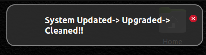

# auto-update_clean
Are you tired of always running more that three different commands on the terminal to update, upgrade and clean your linux/debian repositories and packages? Here is a simple solution that does the update, upgrade, unclutter and more using a single command.

## Purpose:
- Update the local package list, fetching information about available package updates from the repositories.
- Upgrade all installed packages to their latest versions.
- Remove packages that were automatically installed to satisfy dependencies for other packages but are no longer needed.
- Clean up the local repository of retrieved package files, freeing up disk space.
- The script then removes old revisions of Snap packages. It uses the `snap list --all` command to list all installed Snap packages, filters out disabled ones, and extracts the Snap name and revision. It then iterates through each disabled Snap package and removes it with the specified revision.
- Finally, notify-send **"System Updated-> Upgraded-> Cleaned!!"** is a desktop notification that informs the user that the system has been updated, upgraded, and cleaned.

## Usage:
1. Clone the repository:
```
git clone git@github.com:King-Kingah/auto-update_clean.git
```
2. Make the file executable by adding permission:
```
chmod +x upgrade_clean.sh
```
3. Run the file as an executable from the terminal, run:
```
./upgrade_clean.sh
```
**NOTE**: If it fails, run as a superuser using:
```
sudo ./upgrade_clean.sh
```
Once it completes, a lovely notification pops up with the message below:




## Important Note:
The script assumes that you have the necessary permissions to run `sudo` commands and that the **notify-send** command is available on your system for displaying notifications. Additionally, it's important to be cautious when removing Snap packages, as it might affect the functionality of installed applications. Always review the script and understand its implications before running it.

## Use Cases:
**Currently, this bash script for Debian based operating systems and has been particularly used and tested on Ubuntu 20.04.3 LTS and Ubuntu 22.04.3 LTS**

- Update and upgrade the system with ease.
- Clean and unclutter the system.
- Free up disk space.